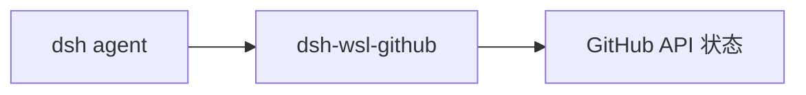

# dsh-wsl-github
> **套件安装：** 见 [dsh-wsl-kit](https://github.com/173787247/dsh-wsl-kit)。推荐 `KIT_SET=daily` | `llm` | `github` | `full`。故障树：[TROUBLESHOOTING.zh.md](https://github.com/173787247/dsh-wsl-kit/blob/master/docs/TROUBLESHOOTING.zh.md)。


DeepSeek Harness 工具：**`github_app_hint`** + **`github_repo_status`** — 用 GitHub App 鉴权，查看当前仓库未关闭的 PR 与最近一次 Actions。

属于 **[dsh-wsl-kit](https://github.com/173787247/dsh-wsl-kit)**。

[English → README.md](./README.md)

## 在套件里的位置

提示 GitHub App 环境文件在不在，并报告仓库 PR / Actions。绝不倾倒密钥。



整套关系图和版本快照：[dsh-wsl-kit 中文说明](https://github.com/173787247/dsh-wsl-kit/blob/master/README.zh.md)。本插件是 **0.2.0**（github）。不要把那份总表抄进本 README。


---
## 兼容性

| 项 | 值 |
|----|----|
| **插件** | `dsh-wsl-github` **0.2.0** |
| **最低 dsh** | ≥ **0.1.2**（Windows 中继 `:3081` 一次性 `?token=`） |
| **最新验证** | 以 [dsh-wsl-kit 兼容性](https://github.com/173787247/dsh-wsl-kit#compatibility-2026-09) 为准（当前 **`0.1.7-alpha.2`**）— 套件唯一真源 |
| **套件档位** | `github` / `full` |
| **云端 Flash** | settings / `llm-deepseek` 使用 **`deepseek-flash`**（V4.1 Flash）；本插件不配置模型 id |
| **Agent Teams** | 上游实验包；本插件不依赖 |

套件版本地板：[`check-plugin-versions.sh`](https://github.com/173787247/dsh-wsl-kit/blob/master/scripts/check-plugin-versions.sh)。故障树：[TROUBLESHOOTING.zh.md](https://github.com/173787247/dsh-wsl-kit/blob/master/docs/TROUBLESHOOTING.zh.md)。

## 为什么需要这个插件

WSL 里的 Agent 已有 [`dsh-wsl-cred`](https://github.com/173787247/dsh-wsl-cred)（`cred_hint`）管 **git 推送凭据**。还需要 **GitHub API** 回答「开着哪些 PR？」「CI 绿了没？」——并且不要把 PAT 贴进对话。

本插件在内存里换短期 **GitHub App installation token**。工具输出不含私钥、JWT、token。返回的 `html_url` 用 [`dsh-wsl-browser`](https://github.com/173787247/dsh-wsl-browser) 的 `win_open_url` 在 Windows 浏览器打开。

刻意做小：**不是** 40 个工具的通用 GitHub 连接器。

## 和 dsh-wsl-kit 怎么配合

DSH 在 **WSL**、聊天在 **Windows 浏览器**，正是 kit 的主场。连 GitHub 时建议整套一起用：

| 要做的事 | 插件 | 工具 |
|----------|------|------|
| 推送 / HTTPS 凭据 | [dsh-wsl-cred](https://github.com/173787247/dsh-wsl-cred) | `cred_hint` |
| API：未关闭 PR + 最近 Actions | **本插件** | `github_app_hint`、`github_repo_status` |
| 在 Windows 打开 PR / Actions | [dsh-wsl-browser](https://github.com/173787247/dsh-wsl-browser) | `win_open_url` |
| 代理 / Node 24 打不通 | [dsh-wsl-net](https://github.com/173787247/dsh-wsl-net) | `net_doctor` |

**走 kit 为什么方便**

- 跟路径、剪贴板、通知同一套装（`dsh-wsl-kit` / `install.sh`），不用临时塞 PAT。
- 密钥落在 `~/.dsh/` 与进程内存，不进 Trajectory。
- 和 kit 其它插件同一心智模型：小工具、分清 WSL / Windows 边界。
- 有真实的 GitHub App 集成，可报名 [GitHub Developer Program](https://docs.github.com/en/integrations/concepts/github-developer-program)。

套件总览：[dsh-wsl-kit 中文说明](https://github.com/173787247/dsh-wsl-kit/blob/master/README.zh.md)。

## 工具

| 工具 | 作用 |
|------|------|
| `github_app_hint` | 是否已配置 App / `~/.dsh/dsh-wsl-github.env`（只查存在性）、配置步骤与 vs cred/ssh/`win_open_url` 分工（不回传密钥） |
| `github_repo_status` | 未关闭 PR（最多 5 条）+ 最近一次 Actions。可传 `repo`，默认 `git origin` |

配好 env 后可自测 `github_app_hint`（不做真实 App 冒烟，需用户 PEM）。

## 端到端用法（WSL）

1. **安装插件**（随 kit 或单独）：

```sh
dsh plugin --profile web add github:173787247/dsh-wsl-github
```

2. **一次性注册 GitHub App**（权限来自 [`github-app-manifest.json`](./github-app-manifest.json)，已预填）：

```sh
npm run register-app
```

在 GitHub 上保留或改名 → 点 **Create GitHub App**。脚本把 App ID 和 PEM 写到 `~/.dsh/`，**不会**把密钥打到终端。

| 权限 | 访问 | 用途 |
|------|------|------|
| **Metadata** | 读 | 仓库名、默认分支 |
| **Pull requests** | 读 | 列出未关闭 PR |
| **Actions** | 读 | 最近一次 workflow |
| Webhook | 关 | 本插件轮询 API，不收事件 |
| 安装范围 | 私有 App（`public: false`） | 开发时装到自己的账号 |

3. **把 App 安装到你的 GitHub 账号**（脚本打印的 Install 链接，或 [apps/dsh-wsl-github](https://github.com/apps/dsh-wsl-github)）。可选 **All repositories**，或只勾需要的仓库。

4. **启动 `dsh web` 前加载环境**（WSL / bash）：

```sh
set -a
source "$HOME/.dsh/dsh-wsl-github.env"
set +a
dsh web
```

若从 Windows PowerShell 启动：

```powershell
Get-Content "$HOME\.dsh\dsh-wsl-github.env" | ForEach-Object {
  if ($_ -match '^(GITHUB_[A-Z_]+)=(.*)$') { Set-Item -Path "Env:$($matches[1])" -Value $matches[2] }
}
```

5. 开**新会话**，例如对 Agent 说：

   - 「跑一下 `github_app_hint`。」
   - 「对当前仓库跑 `github_repo_status`。」
   - 「用 `win_open_url` 打开那个 `html_url`。」

连不上 GitHub HTTPS 时跑 `net_doctor`；`git push` 失败时跑 `cred_hint`——那是另一件事，不是本插件的职责。

不用脚本时：打开 [注册 GitHub App](https://github.com/settings/apps/new)，Homepage 填 `https://github.com/173787247/dsh-wsl-kit`，权限同上、关掉 webhook，生成私钥后：

```sh
cp examples/dsh-wsl-github.env.example ~/.dsh/dsh-wsl-github.env
# 编辑填入 GITHUB_APP_ID，PEM 放到 ~/.dsh/dsh-wsl-github.pem
source "$HOME/.dsh/dsh-wsl-github.env"
```

或手动：

```sh
export GITHUB_APP_ID=123456
export GITHUB_APP_PRIVATE_KEY_PATH="$HOME/.dsh/dsh-wsl-github.pem"
```

`GITHUB_TOKEN` / `GH_TOKEN` 只适合本机冒烟，不是正式鉴权。

可选：API 通了之后到 [github.com/developer/register](https://github.com/developer/register) 加入 Developer Program（产品网站可填 kit 或本插件仓库地址）。

## 配置

```yaml
- id: dsh-wsl-github
  name: dsh-wsl-github
  config:
    timeoutMs: 20000
    appId: ""
    privateKeyPath: ""
    installationId: ""
```

空字符串表示「从环境变量读」。后写的 profile `config` 会**整段替换**。

## 测试

```sh
npm test
```

## 许可

MIT
